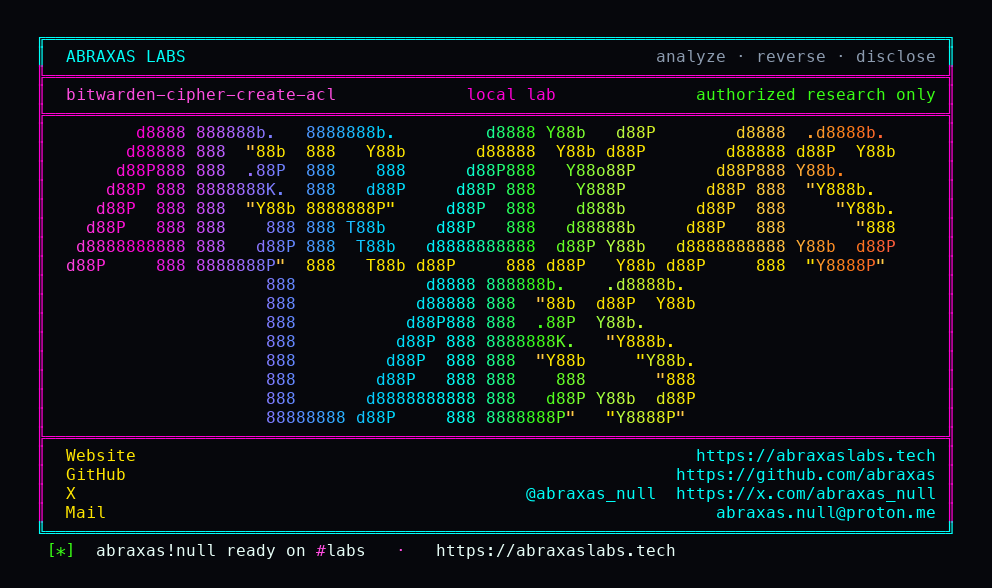

<p align="center">
  
</p>

<p align="center">
  <a href="https://abraxaslabs.tech"><strong>abraxaslabs.tech</strong></a>
  &nbsp;·&nbsp;
  <a href="https://github.com/abraxas">github.com/abraxas</a>
  &nbsp;·&nbsp;
  <a href="https://x.com/abraxas_null">@abraxas_null</a>
  &nbsp;·&nbsp;
  <a href="mailto:abraxas.null@proton.me">abraxas.null@proton.me</a>
  &nbsp;·&nbsp;
  <a href="https://github.com/abraxas/bitwarden-cipher-create-acl">bitwarden-cipher-create-acl</a>
</p>

# bitwarden-cipher-create-acl

**Bitwarden Server** `v2026.9.2` - Bitwarden

Org cipher create on the Entity Framework path (MariaDB, Postgres, SQLite) drops the caller id before collection attach. A confirmed member can plant an org-key item into a collection they cannot write. Collection members sync it as a normal shared login.

| | |
|---|---|
| ID | no CVE yet |
| CWE | [CWE-863](https://cwe.mitre.org/data/definitions/863.html) / [CWE-639](https://cwe.mitre.org/data/definitions/639.html) |
| CVSS | **High: 7.1** `CVSS:3.1/AV:N/AC:L/PR:L/UI:N/S:U/C:N/I:H/A:L` |
| Product | [Bitwarden Server](https://github.com/bitwarden/server) |
| Affected | **v2026.9.2** (`9ee4e0eb`) lite EF (MariaDB / Postgres / SQLite). MSSQL/Dapper keeps `@UserId`. |
| Auth | confirmed org member |
| License | [GNU Affero GPL v3.0](LICENSE) |
| Lab | `127.0.0.1` only |

## What an attacker can do

The attacker **adds** vault items to a shared collection. They do not read or replace the secrets already in it.

A confirmed org member already has the org key, so the new item decrypts for everyone who can see that collection. Bitwarden shows it as a normal shared login, note, card, or SSH key from inside the company vault.

- **Phish from the vault.** Plant a login named like a real shared item (`Okta`, `GitHub`, `VPN`, `Payroll`) whose URI points at a host they control. Collection members open it from Bitwarden and land on the attacker page, or auto-fill against a lookalike.
- **Poison ops.** Plant a secure note or login that looks like a rotation (`new AWS key`, `bastion SSH key`, `DB password after change`). Someone copies it into production or a terminal.
- **Stay after they are kicked.** The create is a new cipher in the collection. It remains for everyone with access after the attacker membership is removed.
- **Bypass read-only.** A contractor who may only read `Production` can still drop a new item into it on lite EF.

If they have no access to the target collection, `POST /api/ciphers/create` can return 404 after the write is already committed. Victims still get the item on sync.

## How I found it

I pinned [bitwarden/server](https://github.com/bitwarden/server) **v2026.9.2** (`9ee4e0eb`) after the 2026 wave: admin-request TDE (CVE-2026-60104), SSO ExternalId truncation (CVE-2026-101878), org import empty collections (CVE-2026-43638). Those are closed. Collection ACL on **create** was not.

[`CiphersController.PostCreate`](https://github.com/bitwarden/server/blob/v2026.9.2/src/Api/Vault/Controllers/CiphersController.cs) only checks org membership, then passes `skipPermissionCheck: true` when `OrganizationId` is set. [`SaveDetailsAsync`](https://github.com/bitwarden/server/blob/v2026.9.2/src/Core/Vault/Services/Implementations/CipherService.cs) then treats "this collection exists in the org" as the only collection check.

Lite MariaDB/Postgres/SQLite use EF. [`CreateAsyncReturnCipher`](https://github.com/bitwarden/server/blob/v2026.9.2/src/Infrastructure.EntityFramework/Vault/Repositories/CipherRepository.cs) sets `cipher.UserId = null` because an org id is present, then hands that null into `UpdateCollectionsAsync`. Null user id means every collection in the org. SQL Server Dapper keeps `@UserId` for `Cipher_UpdateCollections` (`ReadOnly = 0`). That path is the negative.

Wrong turns already recorded: treating cloud `POST /organizations` as the self-host create (it is `[NotSelfHostedOnly]`; lite wants a license file, so the lab seeds org rows after register); planting into a collection the caller cannot read and reading HTTP 404 as a miss (the `CollectionCipher` row is already committed); assuming MSSQL lite would show it (Dapper does not drop the caller id); leaving `BW_ENABLE_ADMIN` off so lite never migrates `User` / `OrganizationDomain` (admin is the EF migrator on this image); omitting `Bitwarden-Client-Version` on `/identity/connect/token` and watching password grant 400. A reverse shell. Theatre.

## Lab

```bash
cd lab
./run.sh
```

Target **only** `http://127.0.0.1:18160`. Image `ghcr.io/bitwarden/lite:2026.9.2` plus MariaDB.

```text
SUCCESS BITWARDEN-CIPHER-CREATE-ACL create-http=404 collectioncipher=1 victim-sync-has-cipher=yes cipher=<id> negative-http=404 readonly-http=200 BITWARDEN-CIPHER-CREATE-ACL-WITNESS
```

No-access plant returns 404 after `CollectionCipher` is committed. Victim `GET /api/ciphers` and `/api/sync` both contain the new id. Read-only on B returns 200 and still plants. Foreign-org collection stays 404 with no join row.

## The fix

Pass the saving user id into EF `UpdateCollectionsAsync` the same way `CipherDetails_CreateWithCollections` still passes `@UserId` after it nulls the stored `UserId` column. Do not treat a null user as "all collections" on the member create path. Existence in the org is not write access.

## References

- [github.com/bitwarden/server](https://github.com/bitwarden/server) tag [v2026.9.2](https://github.com/bitwarden/server/releases/tag/v2026.9.2)
- [`CiphersController.cs`](https://github.com/bitwarden/server/blob/v2026.9.2/src/Api/Vault/Controllers/CiphersController.cs) (`Post`, `PostCreate`)
- [`CipherService.cs`](https://github.com/bitwarden/server/blob/v2026.9.2/src/Core/Vault/Services/Implementations/CipherService.cs) (`SaveDetailsAsync`)
- [`CipherRepository.cs`](https://github.com/bitwarden/server/blob/v2026.9.2/src/Infrastructure.EntityFramework/Vault/Repositories/CipherRepository.cs) (`CreateAsyncReturnCipher`, `UpdateCollectionsAsync`)
- [CWE-863](https://cwe.mitre.org/data/definitions/863.html)

## License

[GNU Affero GPL v3.0](LICENSE)
